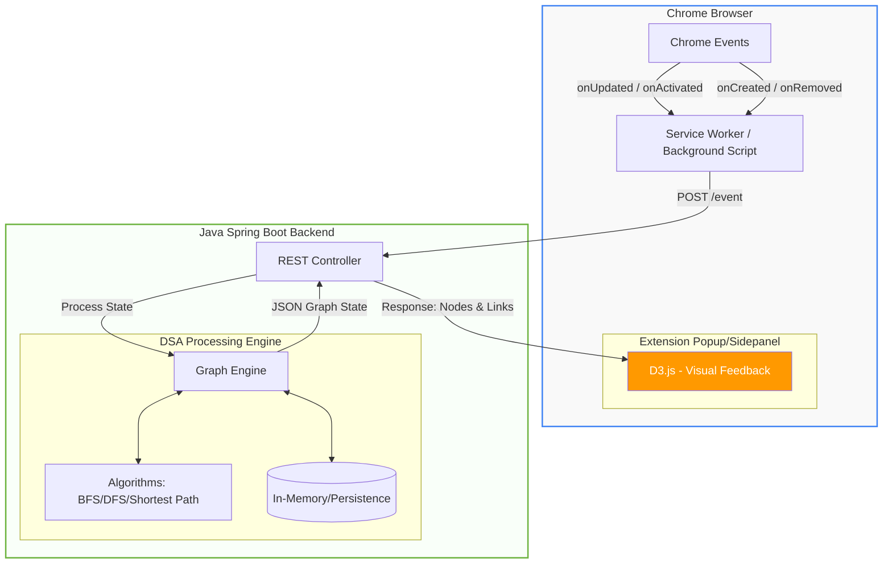

# DAA

## System Architecture

```mermaid
graph TD
    subgraph Browser_Environment ["Chrome Browser"]
        CE[Chrome Events] -->|onUpdated / onActivated| SW[Service Worker / Background Script]
        CE -->|onCreated / onRemoved| SW
        
        subgraph Extension_UI ["Extension Popup/Sidepanel"]
            D3[D3.js - Visual Feedback]
        end
    end

    subgraph Backend_Infrastructure ["Java Spring Boot Backend"]
        API[REST Controller]
        
        subgraph Logic_Engine ["DSA Processing Engine"]
            GE[Graph Engine]
            AL[Algorithms: BFS/DFS/Shortest Path]
            DB[(In-Memory/Persistence)]
        end
    end

    %% Communication Flow
    SW -->|POST /event| API
    API -->|Process State| GE
    GE <--> AL
    GE <--> DB
    GE -->|JSON Graph State| API
    API -->|Response: Nodes & Links| D3
    

    %% Styling
    style Browser_Environment fill:#f9f9f9,stroke:#4285F4,stroke-width:2px
    style Backend_Infrastructure fill:#f9fff9,stroke:#6db33f,stroke-width:2px
    style D3 fill:#ff9900,color:#fff
```